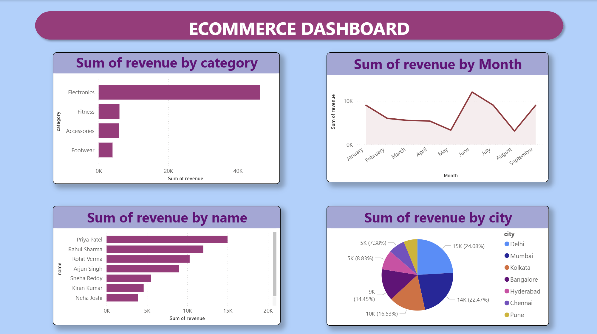

# 🛒 E-Commerce Sales Analysis

A complete end-to-end data analysis project using SQL, Python, and Power BI.



---

## 📌 Project Overview

This project analyzes e-commerce sales data to uncover insights about revenue trends, top customers, popular product categories, and city-wise performance.

---

## 🛠️ Tools & Technologies

- **SQLite** — Database storage and SQL queries
- **Python (Pandas, Matplotlib)** — Data cleaning and analysis
- **Jupyter Notebook** — Interactive analysis environment
- **Power BI** — Interactive dashboard and visualizations

---

## 📁 Project Structure

```
ecommerce-sales-analysis/
│
├── 📄 README.md
├── 🗄️ ecommerce.db
├── 📓 sales_analysis.ipynb
├── 📊 ecommerce_dashboard.pbix
├── 📁 data/
│   └── orders_data.csv
└── 📁 images/
    └── dashboard.png
```

---

## 🗄️ Database Schema

**customers** — customer_id, name, city, signup_date

**orders** — order_id, customer_id, product_id, quantity, order_date

**products** — product_id, product_name, category, price

---

## 📊 Key Insights

- 📦 **Electronics** is the top revenue-generating category
- 🏙️ **Mumbai** leads in city-wise revenue (24%)
- 👤 **Priya Patel** is the highest revenue customer
- 📈 Revenue peaked in **June** and dipped in **August**

---

## 🚀 How to Run

1. Clone the repository
```bash
git clone https://github.com/your-username/ecommerce-sales-analysis.git
```

2. Open `sales_analysis.ipynb` in Jupyter Notebook

3. Open `ecommerce_dashboard.pbix` in Power BI Desktop

---

## 📝 Note

This is my **first end-to-end data analysis project**, built to demonstrate my skills in SQL, Python, and data visualization. The dataset used is **demo/synthetic data** created for learning purposes and does not represent any real business or organization.

I built this project to strengthen my understanding of the full data analysis workflow — from database design and SQL querying, to Python analysis, and finally to building an interactive dashboard in Power BI.

Feedback and suggestions are always welcome! 🙌

---

## 💬 Reviews & Feedback

Yes, you can absolutely leave feedback! Here's how:

- ⭐ **Star this repository** if you found it useful or interesting
- 🐛 **Open an Issue** → click the "Issues" tab → "New Issue" to share suggestions or feedback
- 💬 **Comment on commits** by clicking any commit in the history

If you are an experienced data analyst or developer, I would truly appreciate your feedback on:
- Code quality and structure
- Dashboard design
- Any improvements I can make as a beginner

Your comments mean a lot and will help me grow! 🙏

---

## 👤 Author

**Md Burhannuddin Ilyas** — Aspiring Data Analyst

